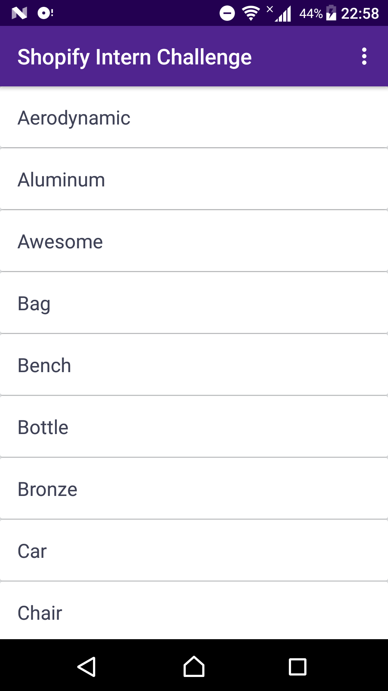
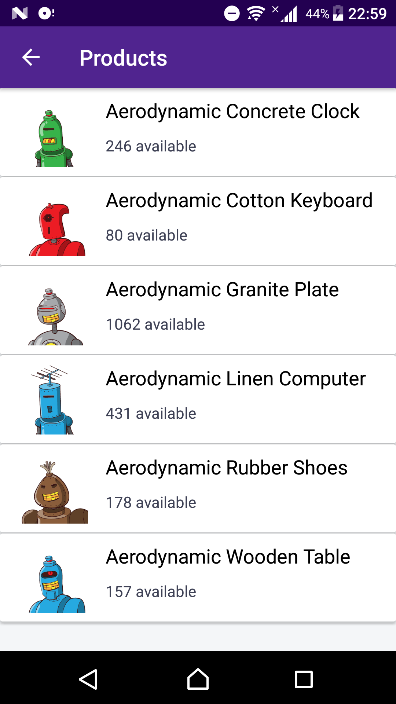

# Shopify Mobile Intern Challenge (Android) Winter 2019

This repository contains my solution for the Shopify Mobile Intern Challenge (Android) Winter 2019.
Find the Problem description [here](Problem.md).

## Contributing
Feel free to contribute with suggestions and bug reports via
 [issue](https://github.com/rosariopfernandes/ShopifyMobileInternChallengeWinter2019/issues/new).

## License
This Project is licensed under the [MIT License](LICENSE).

## Acknowledgements

The project makes use of the following open source libraries:

- [Retrofit](http://square.github.io/retrofit/)

- [Glide](https://bumptech.github.io/glide/)

- [livedata-ktx](https://github.com/Shopify/livedata-ktx)
